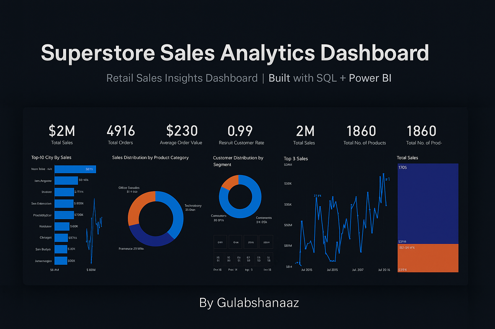

# Sales Performance & Customer Insights Dashboard 📊

This project showcases an end-to-end business intelligence solution built using SQL and Power BI. It analyzes sales performance, customer behavior, and product trends using a simulated Superstore retail dataset. The dashboard is designed for cross-functional stakeholders to monitor KPIs and drive data-informed decisions.

---

## 🔍 Objective

To develop an interactive dashboard that provides insights into:
- Regional and monthly sales performance
- Customer segments and purchasing behavior
- Product category and sub-category trends
- Key performance indicators (KPIs) such as revenue, profit margin, and order volume

---

## 🧰 Tools & Technologies
- **Power BI** – For data modeling, visualization, and dashboard development
- **SQL** – For data transformation, joining, filtering, and aggregation
- **Python (Optional)** – For data preprocessing (Jupyter Notebook included)
- **Dataset** – Superstore retail dataset (available in `.csv` and `.sql` formats)

---

### 📌 Problem Statement

This project addresses the need to analyze and extract actionable insights from the sales data of a fictional superstore. Key challenges include cleaning messy raw data, transforming it into an analyzable format, identifying performance trends, and visualizing KPIs in a way that supports business decision-making.

### ✅ Solution

The solution integrates Python, SQL, and Power BI to build a complete data analysis pipeline. The workflow includes:

- **Data Cleaning:** Used Python to clean and prepare the raw Excel dataset.
- **Data Modeling:** Converted cleaned data into CSV and imported it into a SQL database for structured querying.
- **Exploratory Analysis:** Performed analysis using SQL to derive insights into sales trends, customer segments, and product performance.
- **Visualization:** Designed interactive Power BI dashboards to present insights in a user-friendly and decision-oriented manner.

This project demonstrates the power of combining data engineering, analytics, and visualization tools to deliver business-ready insights.

## 📁 Project Structure

```
.
├── Superstore Sales Insights.pbix                # Power BI dashboard
├── Superstore_sales_analysis_SQL_Insights.sql    # SQL queries for analysis
├── SuperstoreData_cleaned_dump_Dataset.sql       # SQL dump of cleaned dataset
├── superstore_sales_cleaned.csv                  # Cleaned dataset
├── data_cleaning.ipynb # (Optional) Python script for data preprocessing
└── README.md
```

---

## 📈 Dashboard Features

- 📊 Visual breakdown of sales and profit by region, category, and sub-category  
- 📆 Monthly trend analysis and Year-over-Year growth  
- 📦 Top-performing products and customer segments  
- 🎯 Slicers and drill-throughs for interactive analysis

---

## 🔗 Skills Demonstrated

- SQL-based data modeling, transformation, and KPI extraction  
- Power BI dashboard design using DAX measures and interactive visuals  
- Data cleaning, integration, and validation across multiple sources  
- Business-focused analytics for stakeholder decision support  
- Exploratory data analysis and insight communication through storytelling

---

> 💡 This project was developed as a portfolio piece to demonstrate real-world business intelligence and dashboarding capabilities. Data used is publicly available and anonymized.
